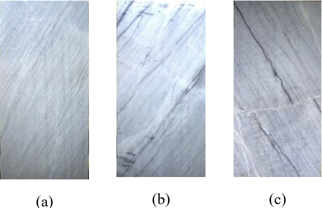

# Drama Dolomitic Ornamental Marble (D-DOM) Image Dataset
## Grey Lais Dolomitic Ornamental Marble
Grey Lais, or Kokkinoghia Grey according to the EN 12440 European Standard for natural stone, is a dolomite marble composed 94% of the minerals dolomite CaMg(CO3)2 and 6% CaCO3 calcite. Dolomitic marble is a metamorphosed, i.e. exposed to excessive heat and pressure, dolostone and is generally harder than marble, which is mainly composed of the mineral calcite. The formation of dolostones, from which dolomitic marbles are formed, is a scientific problem. It is generally accepted that dolostones are formed by the chemical alteration of limestones in a chemical reaction known as dolomitization. After the metamorphosis of a dolostone ornamental rocks, like the Grey Lais, are produced.

The dataset consists of 441 digital images, which were acquired with a low cost experimental setup in situ at Solakis Antonios Marble S.A[^1].
The dataset was classified into three classes by an expert. This classification was based on certain objective criteria of the texture. In general high quality tiles of the dataset are characterized by uniform lineation, minimal fractures, absence of displacement and non-detectable irritating inclusion, i.e. spots. In the case of the dataset available, class A showed a good lineation with minimal cracks, veins or spots (a). In class B, the dolomite marble tiles contain some cracks cutting the main lineation in different angles (b). Class C showed perpendicular fractures with displacement of the main lineation (c). Darker spots are also commonly present. 

<p align="center">
    
</p>

## Dataset Properties

* Total samples: 441
* Number of classes: 3 (A, B, C)
* Samples per class: 147
* Image format: jpg
* Image size: 400x700

The marbles were manually extracted from the original images and resized to the above image size.

## Additional Information
The provided ```folds.p``` includes the folds from the 10 fold cross-validation technique that was generated and employed during our experiments.
Each sample in the folds contains the path to the corresponding sample.

### Loading
```
import pickle

folds = pickle.load(open("folds.p", "rb"))
```

### Accessing
```
(x_train, x_test, y_train, y_test) = folds[0]
print(y_train[0])
# A
print(x_train[0])
# ./images/A/09072020080054_0.jpg
print(len(y_train), len(y_test))
# 396 45 
```

or

```
for x_train, x_test, y_train, y_test in folds:
    ...
```


## Related works
* G. K. Sidiropoulos, A. G. Ouzounis, G. A. Papakostas, I. T. Sarafis, A. Stamkos and G. Solakis, "**Texture Analysis for Machine Learning Based Marble Tiles Sorting**," 2021 IEEE 11th Annual Computing and Communication Workshop and Conference (CCWC), 2021, pp. 0045-0051, doi: 10.1109/CCWC51732.2021.9376086.
* A. G. Ouzounis, G. Taxopoulos, G. A. Papakostas, I. T. Sarafis, A. Stamkos, and G. Solakis, **“Marble quality assessment with deep learning regression**,” in 2021 fifth international conference on intelligent computing in data sciences (ICDS, 2021, pp. 1–5. doi: 10.1109/ICDS53782.2021.9626726.
* Athanasios Ouzounis, G. Sidiropoulos, G. Papakostas, I. Sarafis, A. Stamkos, and G. Solakis, **“Interpretable Deep Learning for Marble Tiles Sorting**,” in Proceedings of the 2nd International Conference on Deep Learning Theory and Applications, Online Streaming, --- Select a Country ---, 2021, pp. 101–108. doi: 10.5220/0010517001010108.
* G. K. Sidiropoulos et al., "**Exploiting Deep Metric Learning for Mable Quality Assessment with Small and Imbalanced Image Data**," 2021 IEEE 12th Annual Information Technology, Electronics and Mobile Communication Conference (IEMCON), 2021, pp. 0266-0269, doi: 10.1109/IEMCON53756.2021.9623255.

## Citation
If you use the dataset in a scientific publication, please cite us using the following bibtex citation:
```
@Article{jimaging8070191,
AUTHOR = {Sidiropoulos, George K. and Ouzounis, Athanasios G. and Papakostas, George A. and Lampoglou, Anastasia and Sarafis, Ilias T. and Stamkos, Andreas and Solakis, George},
TITLE = {Hand-Crafted and Learned Feature Aggregation for Visual Marble Tiles Screening},
JOURNAL = {Journal of Imaging},
VOLUME = {8},
YEAR = {2022},
NUMBER = {7},
ARTICLE-NUMBER = {191},
URL = {https://www.mdpi.com/2313-433X/8/7/191},
ISSN = {2313-433X}
}
```

[^1]: https://www.solakismarble.com/
